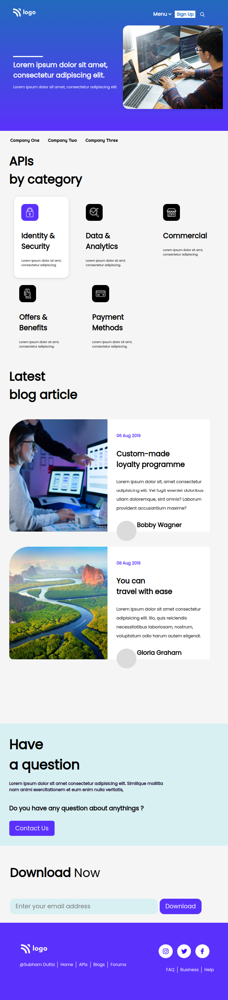

# Assignment 9 
## Full Stack Javascript Web Development Course by [iNeuron](https://ineuron.ai/)

This webpage is created with HTML and CSS only. It is a mobile responsive webpage. I have used media query to give responsiveness to this webpage. It took me almost 6 to 7 hours to complete this project. All the images and logos were provided by iNeuron team.

[Click Here](https://fsjs-assignment9.netlify.app/) to view the website.

## Screenshots of the web-page:

  

### Screenshot of full webpage in smaller screens:

## Contact me: [Linkedin](https://www.linkedin.com/in/subham-dutta-8670b8178/) | [Github](https://github.com/Sduttt) | [Twitter](https://twitter.com/Subhamd88404337) | [Facebook](https://www.facebook.com/profile.php?id=100073951804006) | [Instagram](https://www.instagram.com/its_subham_dutta/)

## Find me on [Findcoder.io](https://www.findcoder.io/u/sdutta)